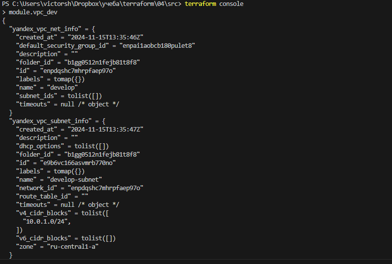
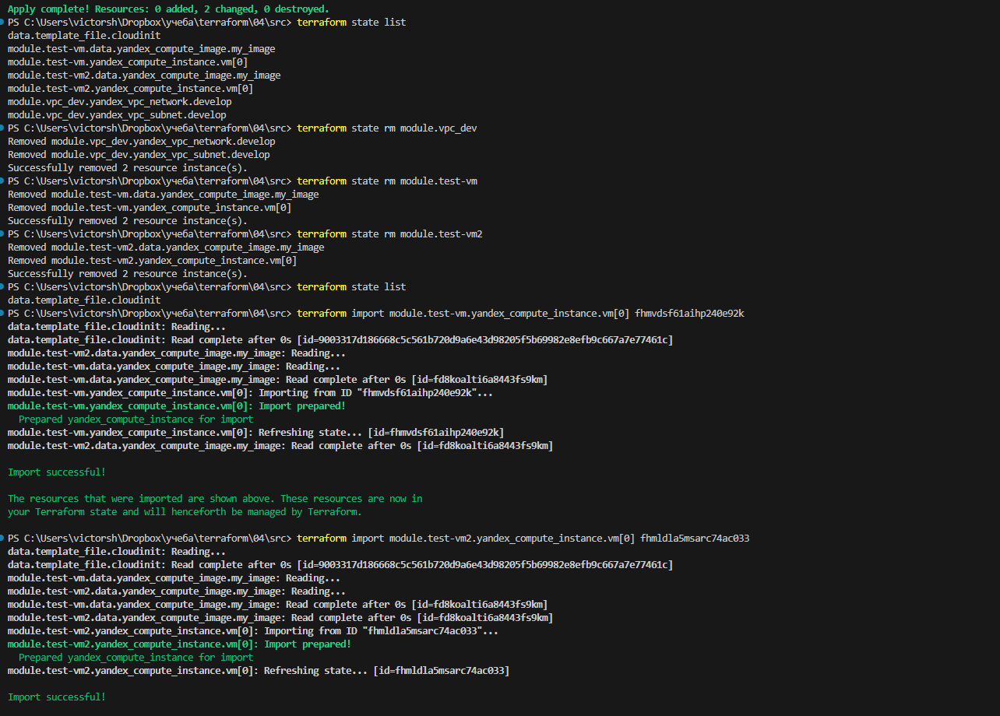
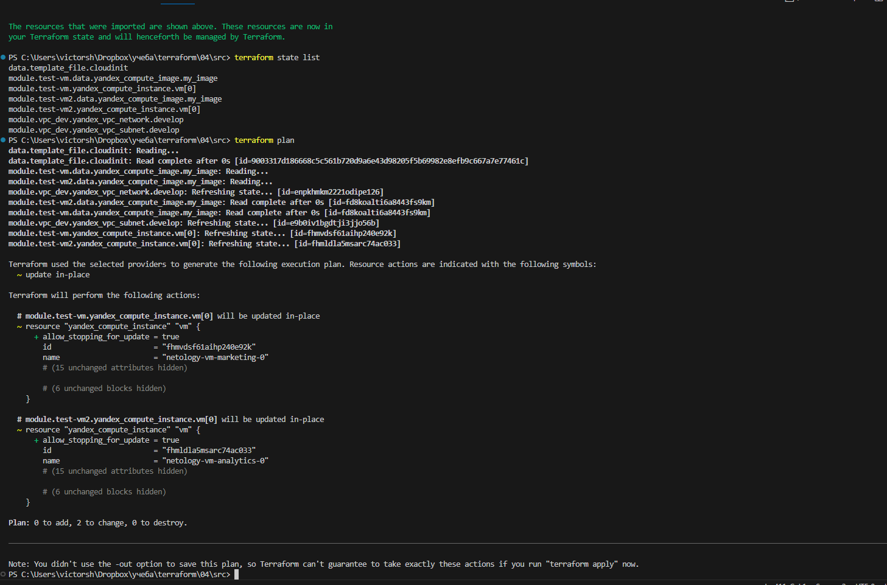

**Задание 1**

Возьмите из демонстрации к лекции готовый код для создания с помощью двух вызовов remote-модуля -> двух ВМ,

относящихся к разным проектам(marketing и analytics) используйте labels для обозначения принадлежности.

В файле cloud-init.yml необходимо использовать переменную для ssh-ключа вместо хардкода.

Передайте ssh-ключ в функцию template\_file в блоке vars ={} . Воспользуйтесь примером. Обратите внимание, что ssh-authorized-keys принимает в себя список, а не строку.

взял код из предложенного примера.

поменял labels на 

*labels = {* 

*# owner= "i.ivanov",*

*project = "analytics"*

*}*

передал ssh-ключ в функцию template\_file в блоке vars ={} по примеру https://grantorchard.com/dynamic-cloudinit-content-with-terraform-file-templates/

*data "template\_file" "cloudinit" {*

*template = file("./cloud-init.yml")*

*vars = {*

*ssh\_public\_key     = file("~/.ssh/ycbarmaq.pub")*
*}*

*}*

Обратите внимание, что ssh-authorized-keys принимает в себя список, а не строку - на случай если надо добавить несколько ключей
  

  скриншот подключения к консоли и вывод команды sudo nginx -t  
  
  скриншот консоли ВМ yandex cloud с их метками.  
  
  Откройте terraform console и предоставьте скриншот содержимого модуля  
  
  

**Задание 2**

Напишите локальный модуль vpc, который будет создавать 2 ресурса: одну сеть и одну подсеть в зоне, объявленной при вызове модуля, например: ru-central1-a.

создаем подпапку vpc\_dev и в ней простой модуль из трех частей :

variables.tf		- обьявляем переменные, но не задаем. мы их передадим позже

main.tf				- указываем провайдера! создаем ресурсы

outputs.tf			- выводим output созданного ресурса сабнета  ( по заданию позже )

примеры посматривал так же тут :

https://www.youtube.com/watch?v=3tQ-\_rid7MU&ab\_channel=ADV-IT

Вы должны передать в модуль переменные с названием сети, zone и v4\_cidr\_blocks. :

тут понятно. в этом и смысл модулей.

Модуль должен возвращать в root module с помощью output информацию о yandex\_vpc\_subnet. Пришлите скриншот информации из terraform console о своем модуле. Пример: > module.vpc\_dev

добавил файл outputs.tf в папку модуля

Замените ресурсы yandex\_vpc\_network и yandex\_vpc\_subnet созданным модулем. Не забудьте передать необходимые параметры сети из модуля vpc в модуль с виртуальной машиной. :

вызывал модуль из основной main.tf , передал туда значения. 

важно - имена значений (в левой части ) должны совпадать с обьявленными в модуле переменными !

пример обращения к результатам модуля 

*module.vpc\_dev.yandex\_vpc\_net\_info.id*

Сгенерируйте документацию к модулю с помощью terraform-docs

установил при помощи scoop

https://terraform-docs.io/user-guide/installation/

в папке с модулем 

*terraform-docs markdown . > README.md*

получаем файл  README.md в папке модуля
  
  Пришлите скриншот информации из terraform console о своем модуле. Пример: > module.vpc_dev  
    
  Сгенерируйте документацию к модулю с помощью terraform-docs   
  [readme](./vpc/README.md)  

**Задание 3**

Выведите список ресурсов в стейте.

*terraform state list*

*module.vpc\_dev.yandex\_vpc\_network.develop*

*module.vpc\_dev.yandex\_vpc\_subnet.develop*

Полностью удалите из стейта модуль vpc.

*terraform state rm module.vpc\_dev*

Полностью удалите из стейта модуль vm.

*terraform state rm*

Импортируйте всё обратно. Проверьте terraform plan. Значимых(!!) изменений быть не должно. Приложите список выполненных команд и скриншоты процессы.

*terraform import module.vpc\_dev.yandex\_vpc\_network.this <network-id>*

*terraform import module.vpc\_dev.yandex\_vpc\_subnet.this <subnet-id>*

  Проверьте terraform plan. Значимых(!!) изменений быть не должно. Приложите список выполненных команд и скриншоты процессы.  
    
    
    

**задание 4**

Измените модуль vpc так, чтобы он мог создать подсети во всех зонах доступности, переданных в переменной типа list(object) при вызове модуля.

переделал модуль в vpc2

создаем переменную в основных variables

вызываем наш новый модуль в main.tf

*module "vpc\_dev" {*

`  `*source       = "./vpc2"*

`  `*vpc\_name     = "production"*

`  `*vpc\_subnets  =  var.vpc\_dev*

*}*

помним что теперь результат модуля создающего подсети будет обьектом. поэтому при вызове теперь надо или указать конкретный ключ или перебрать все имеющиеся

*module.vpc\_dev.yandex\_vpc\_subnet\_info["ru-central1-a-10.0.1.0/24"].id*

или

*[for key, subnet in module.vpc\_dev.yandex\_vpc\_subnet\_info : subnet.zone]*

изменеый модуль в ./vpc2

**Задание 5**

написать модуль для создания кластера mysql с переменой HA контролирующей количество хостов.

написать модуль для создания бд и пользователя с правами на нее

Используя оба модуля, создайте кластер example из одного хоста, а затем добавьте в него БД test и пользователя app. 

\- Вот тут извиняюсь. Пока разбирался с модулем забыл про требование к названиям переменных. если критично - переделаю,  уж очень долго кластер создается ( около 8-10 минут )
  
  [mysql_plan](./mysql_plan.txt)   
     
     
     
  

**Задание 6**

с этим модулем не получилось защитить его от удаления.

как это сделать?  

модуль слишком громоздкий и перегруженный для меня. проще просто через ресурс создать.

вставить

`    `*lifecycle {*

`    `*prevent\_destroy = true*

`  `*}*

прямо в вызов ресурса в модуле не помогло.

добавил в main.tf

*module "s3" {*

`  `*source = "./terraform-yc-s3-master/examples/simple-bucket"*

*}*

max\_size              = 1073741824

